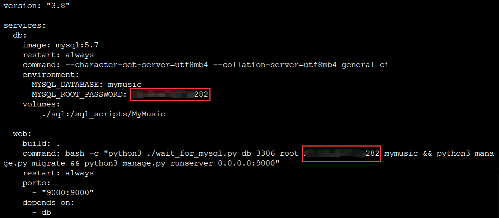
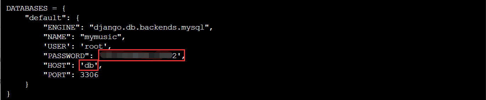
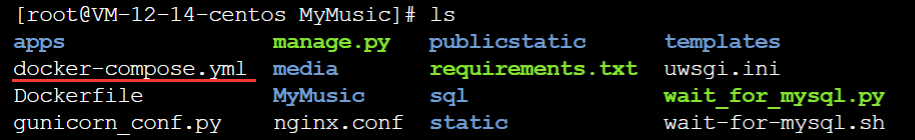

# Docker 快速部署

---

### 修改配置

我们需要留意的文件有：`/docker-compose.yml`、`/MyMusic/settings.py`。

1. **/docker-compose.yml**：

   需要留意一下数据库的密码即可：

   

2. **/MyMusic/settings.py**：

   同样也需要留意数据库的信息：

   

   注意`HOST`字段一定要是`docker-compose.yml`中的数据库的服务名称，不能是具体的 IP。db 这个名字就类似于一个域名一样，当连接数据库时，docker 会解析出这个服务对应的 IP 信息。

### 构建镜像

1. 进入`Dockerfile`对应的目录下

   

2. 使用`docker`构建镜像

   ```bash
   docker-compose up
   ```

3. 接着访问`localhost:9000`即可看到页面。

4. 先通过`Ctrl + C`退出当前状态，然后重新启动容器，让它们处于后台运行的状态

   ```bash
   docker-compose up -d
   ```

5. 到这里全部镜像都已经构建完毕，并且容器也已经启动，但是数据库里面只有对应的数据表，没有任何的数据，下一步我们需要同步`MySQL`中的数据。

### 同步 MySQL 中的数据

1. 查看正在运行的容器

   ```ba
   docker ps
   ```

2. 进入 MySQL 中的命令行

   `container_id`：MySQL 对应的容器 ID。

   ```bash
   docker exec -it container_id env LANG=C.UTF-8 /bin/bash
   ```

   **注意：一定要加上`env LANG=C.UTF-8`这个参数，不然控制台可能无法输入中文，从而导致数据不能正常被插入。**

3. 进入命令行依次执行下列命令（中途可能需要输入密码）

   ```bash
   mysql -u root -p mymusic < /sql_scripts/MyMusic/01_song_sort.sql
   mysql -u root -p mymusic < /sql_scripts/MyMusic/02_song_info.sql
   mysql -u root -p mymusic < /sql_scripts/MyMusic/03_song_dynamic.sql
   ```

   


